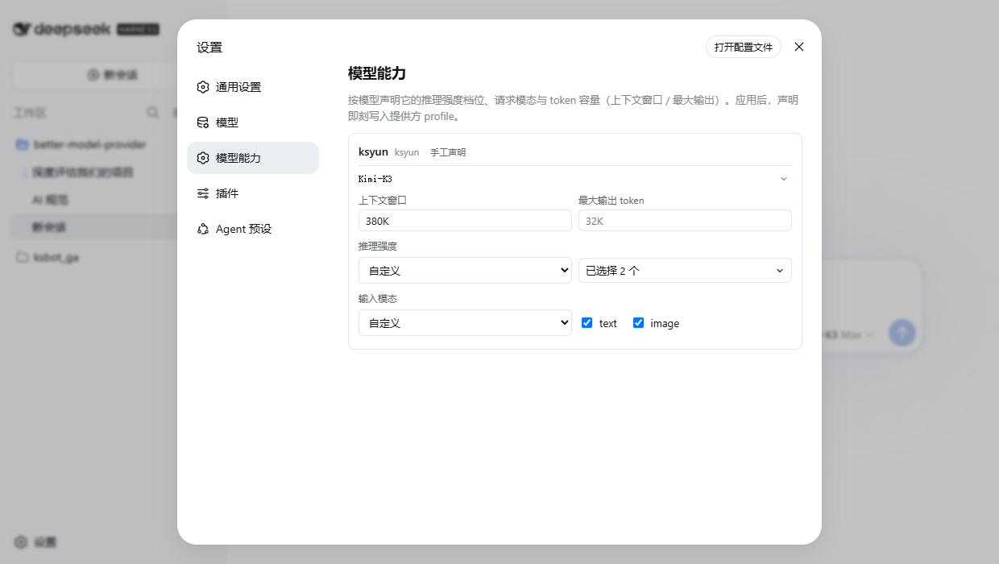

# better-model-provider

Better custom-provider model onboarding for DeepSeek Harness (dsh), with per-model declaration of **native** vision input, reasoning-effort levels, and token capacities (context window / max output).

English | [中文](README.zh.md)



## **Why you may need it**

The official Models page manages providers and model rows, but two per-model capability fields stayed YAML-only: `reasoningEfforts` (which reasoning levels the model accepts, plus each level's wire spelling) and `input` (which request modalities the model admits). This page edits those two **plus** the per-model token capacities (`contextWindow` / `maxTokens`) — on the models you declare — so one row fully configures one model. Until the capability fields are declared:

- the composer's model picker shows no reasoning-effort control for your model;
- image sessions refuse to switch to it (`Model ... does not accept image input`), because a hand-declared model defaults to text-only.

## **Install**

```
# From GitHub:
dsh plugin --profile web add github:sanshanya/better-model-provider

# Local checkout (build first — a `link:` spec is mounted as-is):
npm install && npm run build
dsh plugin --profile web add link:<absolute path to this repo>
```

GitHub installs carry a **build-script catch**: the `github:` spec fetches source only — `lib/` is built by this package's `prepare` run — and pnpm, which dsh uses to compose the profile, does not run a git dependency's build scripts by default. The installer prints the exact key to allow; add it under `allowBuilds` in the profile's `pnpm-workspace.yaml`, then re-run the `add` command.

Restart `dsh web`, hard-refresh the browser, and the settings sidebar gains **Model capabilities**. Uninstall:

```
dsh plugin --profile web rm better-model-provider
```

## **Use**

1. Configure the provider on the official **Models** page first (that's where the API key lives; this page never touches credentials).
2. Open **Settings → Model capabilities**.
3. Expand a model row: pick **Custom** under reasoning effort and check the levels; for vision models check `image` under input modalities; fill the context window / max output tokens when the provider default is wrong. Provider and model lifecycle stays on the official Models page.
4. Apply. The picker immediately offers exactly the declared levels, and the host's image admission admits the model.

Small note: declaring `{ high }` alone gives the picker only High; also check `off` (blank wire → `null`) if Off should be available.

## **Development**

See `CONTRIBUTING.md` for the gate list (build / test / coverage / lint / typecheck / verify:pack) and the two real-harness lanes; `ci` runs the hermetic gates per push and `live` runs nightly.

## **Compatibility**

Verified against a DeepSeek Harness checkout at master commit `47f943859b` (2026-08-13). The published contract line is `0.1.0-rc.7` (real npm ancestry: rc.2 → rc.3 → rc.6 → rc.7 — the 0.1.0 line never had an rc.4/rc.5), which the nightly live lanes boot in a real browser; development tracks it as devDependency `^0.1.0-rc.7` with typecheck as the drift arbiter. Minimum-known-good: the contract that commit serves — `settings.describe/mutate`, `llm.providers`, the `{ rpcId, result }` envelope, and the model row schema. Internal-only surfaces (settings.section registration shape) are treated as experimental compatibility: a newer harness that doesn't serve them degrades silently instead of breaking the page.

## **License**

MIT
